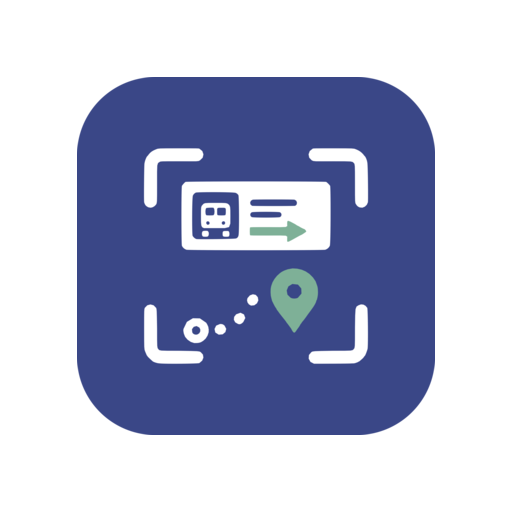
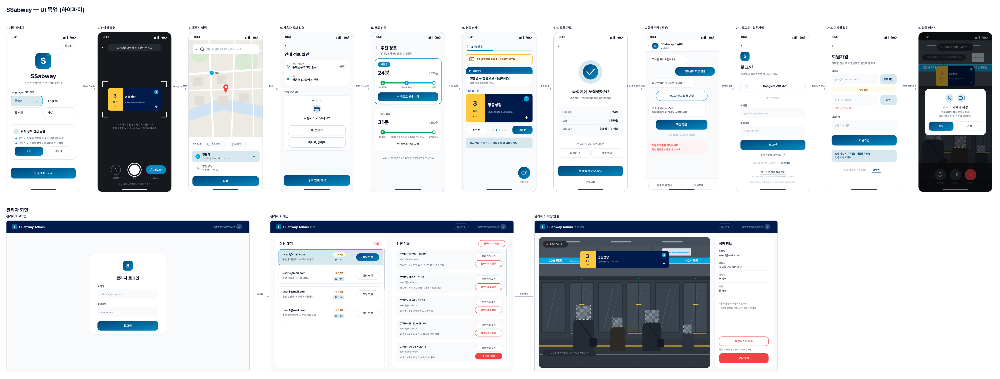

<div align="center">



# SSabway

### 낯선 역에서도, 길은 낯설지 않도록

외국인 여행객을 위한 **지하철 역사 내부 길안내 및 실시간 역무원 상담 서비스**

<br />


**SSAFY 15기 공통 프로젝트 · 팀 8번출구 · 2026.07–2026.08**

</div>

---

## 프로젝트 소개

기존 지도는 역까지의 경로를 안내하지만, 복잡한 지하철 역사 안에서는 GPS 정확도가 떨어져 사용자가 현재 위치와 진행 방향을 판단하기 어렵습니다. 표지판을 번역하더라도 어느 방향으로 이동해야 하는지는 별도로 파악해야 합니다.

SSabway는 사용자가 촬영한 **역사 내 표지판으로 현재 위치를 추정**하고, 목적지까지 이어지는 **실내 경로를 단계별로 안내**합니다. 안내만으로 해결하기 어려운 상황에서는 역무원과 화상 상담을 연결하고, 서로 다른 언어는 실시간 번역 자막으로 보완합니다.

> 길을 찾는 도구는 많았지만, 길을 끝까지 안내하는 도구는 없었습니다.

<br />

<div align="center">
  
</div>

## 해결하고자 한 문제

| 문제 | SSabway의 해결 방식 |
| --- | --- |
| 지하 공간에서 GPS 위치와 방향이 흔들림 | 표지판 촬영 이미지로 역 내부의 현재 위치 추정 |
| 복잡한 환승 통로와 출구를 한눈에 파악하기 어려움 | 역사 내부를 그래프로 모델링하고 최단 경로 안내 |
| 경로에서 이탈하면 기존 안내를 이어가기 어려움 | 주변 표지판을 다시 촬영해 현재 위치부터 경로 재탐색 |
| 외국인과 역무원 사이의 언어 장벽 | WebRTC 화상 상담과 실시간 번역 자막 제공 |
| 반복 민원을 수작업으로 정리해야 함 | 상담 내용을 AI로 요약해 민원 기록으로 관리 |

## 주요 기능

### 1. 표지판 기반 현재 위치 인식

- 촬영 이미지에서 YOLO 모델로 표지판 영역 검출
- 검출 영역을 분류 모델에 전달해 역사 내부 위치 추정
- 다양한 촬영 높이, 시점 및 빛 반사를 반영한 데이터 증강
- 발표 기준 **표지판 인식 정확도 92.9%**

### 2. 역사 내부 맞춤 경로 안내

- 대구역 내부를 **73개 노드와 106개 엣지**로 모델링
- 다익스트라 알고리즘을 이용한 실내 최단 경로 탐색
- ATM, 편의점 등 사용자 상황에 필요한 경유지를 포함해 경로 비교
- 단계별 표지판 사진과 실내 지도로 다음 이동 방향 안내

<div align="center">
  
  
  
</div>

### 3. 다국어 화상 상담

- 사용자의 상담 요청부터 대기, 수락, 진행, 종료까지 상태 관리
- OpenVidu 세션 및 참여자 Connection Token 발급
- 사용자와 역무원이 서로 다른 언어를 사용해도 실시간 번역 자막 제공
- 연결 종료, 창 닫기, 네트워크 이탈 등 비정상 종료 상황 처리

### 4. 상담 기록 관리

- 상담 녹화 파일을 S3에 업로드하고 상담 정보와 연결
- GMS 기반 상담 요약 생성 및 저장
- 역무원용 민원 기록 조회와 이메일·기간 검색
- 악성 사용자를 관리하기 위한 블랙리스트 등록, 조회, 수정 및 해제

## 시스템 아키텍처

<div align="center">
  
</div>

메인 API 서버가 사용자·역무원·경로·상담 상태를 관리하고, WebRTC 서버는 OpenVidu 세션과 녹화 수명주기를 담당합니다. 두 서버는 외부 JWT와 별도로 내부 서비스 인증값을 사용해 통신합니다.

## 기술 스택

| 영역 | 기술 |
| --- | --- |
| Frontend | React 19, TypeScript, Vite, Tailwind CSS, TanStack Query, Zustand, PWA |
| Backend | Java 21, Spring Boot 4.1, Spring Security, Spring Data JPA, Gradle |
| Realtime | OpenVidu 2.32, WebRTC, 실시간 번역 자막 |
| AI | YOLO, ResNet18, GMS Chat Completions |
| Data | MySQL 8, Redis 7, Amazon S3 |
| External API | Google Maps, ODsay, Google OAuth, SMTP |
| Infra | Docker Compose, Nginx, Jenkins, GitLab CI/CD |

## 내가 기여한 부분

**황문규 · Backend / WebRTC**

### 인증과 사용자 도메인

- Spring Security와 JWT 기반 인증·인가 구조 설계
- Access Token 재발급, Refresh Token Redis 분리 및 로그아웃 처리
- 이메일 인증, 비밀번호 재설정, Google 로그인, 회원 탈퇴 API 구현
- USER와 STAFF 권한 및 예외 응답 형식 분리

### 상담 수명주기 설계

- `WAITING → MATCHED → IN_PROGRESS → ENDED/CANCELED` 상태 전이 정의
- 상담 요청, 상태·대기 순번 조회, 역무원 수락 및 사용자·역무원 종료 API 구현
- 메인 API 서버와 WebRTC 서버의 책임을 분리하고 내부 인증 기반 호출 구조 구성
- 중복 요청, 선착순 수락, 참여자 검증 및 실패 시 상태 원복 처리

### OpenVidu와 상담 기록

- OpenVidu 세션 생성과 역할별 Connection Token 발급 연동
- 정상 종료뿐 아니라 사용자 선종료와 연결 이탈 시 상담 상태 정합성 보완
- 녹화 시작·종료, 녹화 메타데이터 저장 및 S3 업로드 흐름 구현
- GMS를 이용한 상담 요약 API와 역무원용 원본 상담·민원 기록 조회 구현

### 운영 기능과 서비스 연동

- 역무원 블랙리스트 CRUD와 민원 기록 검색 구현
- ODsay 경로 탐색 API 연동 및 도시 간 응답 역직렬화 문제 해결
- 다국어 역 이름 대신 `stationId`로 담당 역무원을 조회하도록 변경해 언어별 매칭 오류 제거
- 환경변수 계약을 정리하고 Main API, WebRTC, Docker Compose 설정의 불일치 수정

## 주요 문제 해결 경험

### 분리된 두 서버에서 상담 상태가 어긋나는 문제

상담 정보는 메인 API 서버가 관리하고 OpenVidu 세션은 WebRTC 서버가 관리했습니다. 초기에 두 서버가 상담 수락과 토큰 발급 책임을 중복으로 가지면서 실패 시 DB 상태만 변경되거나 세션만 생성되는 문제가 발생했습니다.

메인 서버를 상담 상태의 기준으로 정하고, WebRTC 서버에는 세션·토큰 처리를 위한 내부 API만 남겼습니다. 내부 호출이 실패하면 메인 서버가 상담 배정을 원복하도록 트랜잭션 경계를 정리했습니다.

### 사용자가 먼저 나가면 상담 기록이 생성되지 않는 문제

종료 버튼을 누르는 정상 경로만 고려하면 브라우저 종료나 네트워크 이탈 시 상담이 `MATCHED` 또는 `IN_PROGRESS`에 남을 수 있었습니다. 녹화 종료와 상담 종료를 하나의 성공 조건으로 묶은 구조도 녹화 실패가 전체 상담 종료를 막는 원인이었습니다.

참여자 이탈 API를 추가하고 종료 주체와 현재 상태를 검증해 상담을 종료하도록 수정했습니다. 상담 상태 종료와 녹화 후처리를 분리해 녹화 문제가 상담 기록 생성을 가로막지 않도록 보완했습니다.

### 언어별 역 이름으로 담당 역무원을 찾지 못한 문제

ODsay 응답이 한국어일 때는 `대구역`, 영어일 때는 `Daegu Station`으로 전달되어 문자열 기반 조회가 실패했습니다. 화면 표시용 역 이름과 시스템 식별자를 분리하고, 언어와 무관한 `stationId`로 역과 역무원을 조회하도록 변경했습니다.

## 프로젝트 회고

이번 프로젝트에서 가장 크게 배운 점은 기능의 성공 경로보다 **상태와 실패 경계를 먼저 설계해야 한다는 것**입니다. 화상 상담은 요청, 수락, 입장, 녹화, 종료가 여러 서버와 외부 서비스에 걸쳐 이어집니다. 한 단계의 성공만으로 전체 흐름이 완료됐다고 판단하면 DB와 실제 세션이 쉽게 어긋났습니다.

상담 상태를 명시적인 enum으로 관리하고, 메인 서버와 WebRTC 서버의 책임을 나누면서 문제를 재현하고 수정할 기준이 생겼습니다. 특히 사용자가 먼저 종료하거나 녹화 서비스가 실패하는 상황을 다루며 외부 서비스의 실패가 핵심 비즈니스 데이터 저장까지 막아서는 안 된다는 점을 체감했습니다.

짧은 개발 기간 동안 인증부터 상담, 관리자 기능과 외부 API 연동까지 넓은 범위를 맡았습니다. 이후에는 통합 테스트와 관측 지표를 더 일찍 구성해 상태 전이 오류를 배포 전에 발견하고, 서버 간 호출에는 재시도·멱등성·보상 처리를 더 체계적으로 적용하고 싶습니다.

## 팀 8번출구

| 이름 | 역할 |
| --- | --- |
| 이송제 | Frontend |
| 이윤우 | Frontend |
| 홍진규 | AI |
| 황문규 | Backend / WebRTC |
| 강석진 | Backend |
| 김민준 | Infra |

## 프로젝트 구조

```text
SSAbway
├── frontend/                 # 사용자·역무원 웹 애플리케이션
├── backend/
│   ├── ssabway/              # 메인 API, 인증, 경로, 상담 상태
│   └── ssabway_webrtc/       # OpenVidu 세션, 녹화, WebRTC 연동
├── ai/                       # 표지판 검출·분류 및 번역 서버
├── deploy/                   # DB 스키마와 배포 설정
├── docs/                     # 설계 문서, 와이어프레임, 지도 자료
└── docker-compose.yml
```

## 로컬 실행

1. 루트의 `.env.example`을 `.env`로 복사하고 필요한 값을 설정합니다.
2. 프론트의 `frontend/public/config.js`에 로컬 API 주소와 제한된 Google Maps 공개 키를 설정합니다.
3. Docker Compose로 서비스를 실행합니다.

```bash
docker compose up -d --build
```

> 실제 인증키와 비밀번호는 저장소에 커밋하지 않습니다. Google Maps 키는 HTTP 리퍼러 제한을 설정해 사용해야 합니다.

---

<div align="center">

### SSabway

**역까지의 안내를, 역 안까지 이어갑니다.**

</div>
